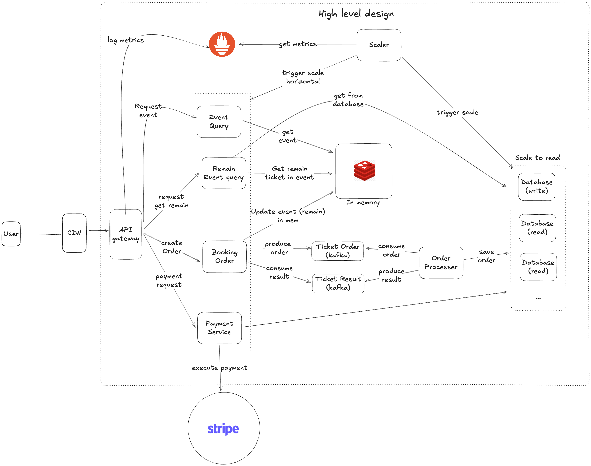

# Design global event booking

### 1. Requirement and clarify

#### Functional Requirement

- Search events
- Book event
- User should be able to put a hold on event (5 minutes) for payment
- Use Payment gateway (like Stripe)
- notifications
- waiting customers should be serve in a fair, first come first serve
- Prevent bot (can discuss more)

#### Non functional Requirement

- handle users from worldwide
- Performance: handle 500.000 user in peek hours
- Scalability: support horizontal scale
- Reliability: Maintain 99.9 % uptime with mechanism for handling failed transactions

#### Noted

### 2. Estimate

- 5m request per days

- metadata booking event: 100.000 records per day

```
100.000 record per day
100kb per user
100.000 * 100 = 10.000.000 kb ~= 10G/day
year: 3650Gb
```

### 3. APIs

#### Searching event

- GET /events/?search=

```
search (
    name: string,
    start_date: Date
    end_date: Data
)
```

Return JSON:

```
[
    {
        id: 1,
        name: "Event 1"
    }
]
```

#### Booking event

- POST /booking

```
{
    "userId": string,
    "eventId: string
}
```
#### Payment

- POST /pay

```
pay (
    userId: string,
    eventId: string,
    amount: string
)
```

-

### 4. Database design

**Users** → **Bookings**: One user can have multiple bookings.

**Events** → **Bookings**: One event can have multiple bookings.

**Bookings** → **Payments**: Each booking has one associated payment.

**Users** → **Notifications**: One user can receive multiple notifications related to various events.


### 5. High level design



Component:

- CDN: deliver web content for user based on geographic location
- API gateway (add Load Balancer): Each replica in a different node in worldwide, support fastest lately for user
- Microservice component: handle core logic
- Cache: Redis
- Database: separate Read and Write (for scale and keep latency)

### 6. Detail Design (Why choose Kafka)

explore workflow:


In a First Come, First Serve (FCFS) workflow for a event system, tickets are allocated based on the order in which customers arrive. The system process ticket requests sequentially, reserving tickets in real-time for earliest requests until seats are filled 

- __Order processor__ are sent to Kafka to enable asynchronous handling and ensure message persistence (Kafka save the message). Kafka's partitioning maintains message order, crucial for accurately tracking ticket availability in a first-come-first-serve system. This design also buffers requests, stabilizing processing flow before reaching the Order Processor
- Other problem: track remain ticket. The Order Processor must preserve order. Instead of costly DB lock, Kafka's single-partition queue ensure sequence and persistence. A single thread process orders in memory, periodically saving snapshots with offsets to the database. This ways, on failure, processing resumes from the saved offset without losing order
- In peak hours: Prometheus can track metrics, while Scaler Service check the rules to determine to scale an instance and when scale a read database.
- Payment: have 2 problems are: Refund và Reconcile. However, using a Payment gateway (Stripe) can simplify these process

### 7. Fault Tolerance
- We deploy multiple instances of the Order Processor but keep only one active. If the primary instance goes down, another instance can immediately take over to ensure continuous operation. 

END